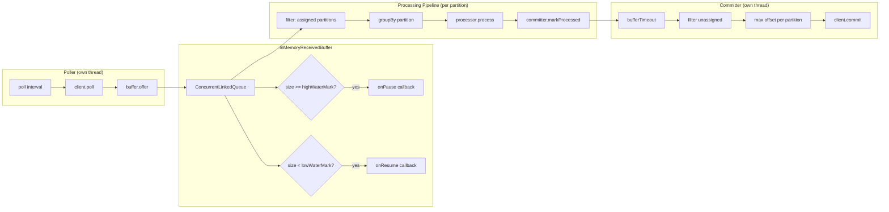
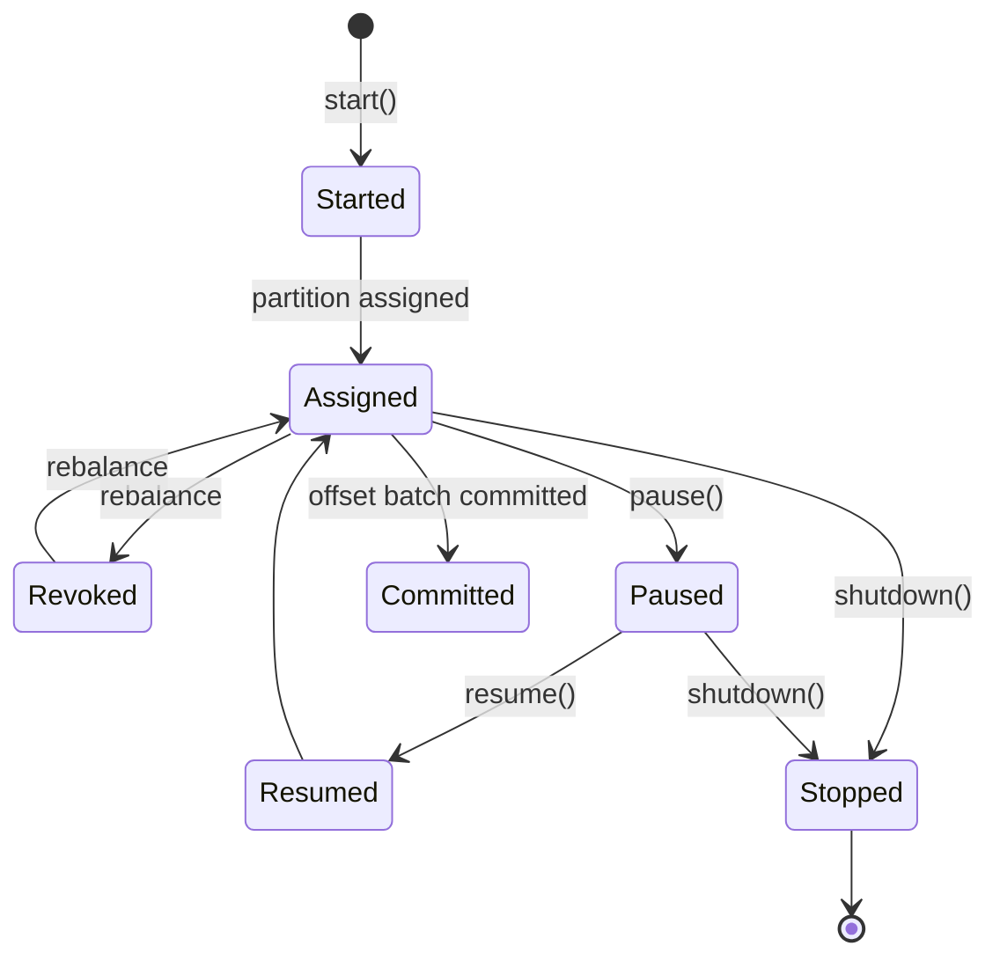

# prozess

Reactive Kafka consumer/producer library for Kotlin, built on [aelv](https://github.com/OyabunAB/aelv) and kotlinx-coroutines.

## Dependency

```kotlin
// Gradle (libs.versions.toml)
prozess = "1.0.0-rc.2"

// build.gradle.kts
implementation("se.oyabun:prozess:1.0.0-rc.2")
```

RC releases are available from GitHub Packages. Add the repository:

```kotlin
maven {
    url = uri("https://maven.pkg.github.com/OyabunAB/prozess")
    credentials {
        username = providers.gradleProperty("gpr.user").orNull ?: System.getenv("GITHUB_ACTOR")
        password = providers.gradleProperty("gpr.token").orNull ?: System.getenv("GITHUB_TOKEN")
    }
}
```

Requires Kotlin 2.4+ and JVM 21+.

## Quick Start

### Consumer

```kotlin
val config = ConsumerConfig(
    bootstrapServers = "localhost:9092",
    groupId          = "my-group",
    topics           = setOf("orders"),
)

val consumer = Prozess.consumer(config, { String(it) }) { headers, key, order ->
    println("Received: $order")
}

consumer.start()
// ... consumer runs until shutdown()
consumer.shutdown()
```

### Producer

```kotlin
val config = ProducerConfig(
    bootstrapServers = "localhost:9092",
    topic            = Topic("orders"),
)

val producer = Prozess.producer(config, { it.toByteArray() })
producer.sendAll(listOf("order-1", "order-2", "order-3"))
producer.close()
```

---

## Consumer Architecture

Two independent pipelines share an in-memory buffer. Backpressure flows from the processing chain through the buffer to the poller.



### Component responsibilities

| Component | Responsibility |
|---|---|
| `BufferedPoller` | Calls `client.poll()` on a loop; feeds records into the buffer; retries on transient poll failures |
| `InMemoryReceivedBuffer` | FIFO queue with high/low watermark callbacks for backpressure; wake-signal channel for demand-driven drain |
| `StreamingConsumer` | Wires all components; routes records per-partition through `Processor`; commits positions via `Committer` |
| `CoordinatingPartitionManager` | Handles rebalance events; commits on revocation; applies seeks on assignment; detects catch-up completion |
| `BufferedCommitter` | Batches processed positions by count/time; filters unassigned partitions; retries commits indefinitely |
| `ThreadsafeKafkaClient` | Serialises all Kafka consumer calls through a single-thread dispatcher |

---

## Consumer Processing Modes

All modes share the same contracts:
- **Tombstones** (null-value records) are logged at INFO and acknowledged.
- **Poison pills** (returned from the deserializer) are logged at WARN and acknowledged.
- **Handler failures** are retried with exponential backoff per `RetryConfig`.

### Per-message (`each`)

```kotlin
Prozess.consumer(config, deserializer)
    .each { p ->
        database.save(p.value)
    }
    .start()
```

### Batched (`batch`)

Records are collected into windows by count or time. The handler receives the full batch atomically — if it throws, the whole batch is retried.

```kotlin
Prozess.consumer(config, deserializer)
    .batch(size = 100, duration = 1.seconds) { batch ->
        database.bulkInsert(batch.map { it.value })
    }
    .start()
```

### Key-grouped per-message (`groupBy + each`)

Records are routed to groups by an application-level key. Records within the same group are processed sequentially; groups are processed concurrently. A `ContiguousOffsetTracker` prevents offset gaps from out-of-order group completion.

```kotlin
Prozess.consumer(config, deserializer)
    .groupBy { p -> p.value.userId }
    .each { userId, p ->
        userCache.update(userId, p.value)
    }
    .start()
```

### Key-grouped batches (`groupBy + batch`)

```kotlin
Prozess.consumer(config, deserializer)
    .groupBy { p -> p.value.tenantId }
    .batch(size = 50) { tenantId, batch ->
        tenantService.process(tenantId, batch.map { it.value })
    }
    .start()
```

### Custom processor

For full pipeline control:

```kotlin
val processor = object : Processor<MyMessage> {
    override fun process(partition: Many<Received<ByteArray>>): Many<Position> =
        partition.map { received -> /* ... */; received.position }
}

Prozess.consumer(config, deserializer)
    .processor(processor)
    .start()
```

---

## Offset Control

### Start offsets

Pass a `StartOffset` to `Consumer.start()`:

```kotlin
consumer.start(from = StartOffset.Earliest)
consumer.start(from = StartOffset.Latest)           // default
consumer.start(from = StartOffset.AtTimestamp(instant))
```

`AtTimestamp` seeks each partition to the first message at or after the given `Instant`. If no message exists at that timestamp the consumer seeks to the end of the partition.

### Catch-up mode

`EndOffset.CatchUp` makes the consumer read up to the offsets that were current at subscription time and then stop normally. Useful for one-shot backfill jobs.

```kotlin
consumer.start(
    from  = StartOffset.Earliest,
    until = EndOffset.CatchUp,
)
```

### Retry configuration

Handler retry backoff is configured via `RetryConfig` on the `DefaultProcessor` factory methods:

```kotlin
Prozess.consumer(config, deserializer)
    .each(
        handler     = { p -> processMessage(p.value) },
        retryConfig = RetryConfig(minBackoff = 100.milliseconds, maxBackoff = 10.seconds),
    )
    .start()
```

---

## Lifecycle Events



Subscribe to events:

```kotlin
// Typed callback (inline reified)
consumer.onEvent<ConsumerEvent.Assigned> { event ->
    println("Assigned: ${event.partitions}")
}

// All events
consumer.onEvent { event ->
    when (event) {
        is ConsumerEvent.Assigned  -> metrics.partitionsAssigned(event.partitions.size)
        is ConsumerEvent.Committed -> metrics.offsetsCommitted(event.offsets)
        is ConsumerEvent.Stopped   -> log.info("Consumer stopped")
        else                       -> {}
    }
}
```

---

## Producer

### Unkeyed (round-robin partitioning)

```kotlin
val producer = Prozess.producer(
    config     = ProducerConfig("localhost:9092", Topic("events")),
    serializer = { it.toByteArray() },
)

producer.send("hello")
producer.sendAll(listOf("a", "b", "c"))
producer.close()
```

### Keyed (per-key ordering)

`sendAll` groups records by the extracted key and sends each key group sequentially, guaranteeing per-key ordering.

```kotlin
val producer = Prozess.producer(
    config        = ProducerConfig("localhost:9092", Topic("orders")),
    keyExtractor  = { order: Order -> order.customerId },
    keySerializer = { it.toByteArray() },
    serializer    = { Json.encode(it).toByteArray() },
)

producer.sendAll(orders)
producer.close()
```

### Headers, partitions, timestamps

```kotlin
val producer = Prozess.producer(
    config             = ProducerConfig("localhost:9092", Topic("events")),
    serializer         = { it.toByteArray() },
    headerEnricher     = { listOf(Header("trace-id", traceId().toByteArray())) },
    partitionExtractor = { event -> event.shardId % numPartitions },
    timestampExtractor = { event -> event.occurredAt.toEpochMilliseconds() },
)
```

### Transactions

```kotlin
val config = ProducerConfig(
    bootstrapServers = "localhost:9092",
    topic            = Topic("results"),
    transactional    = TransactionalConfig.Enabled("my-app-producer-1"),
)

val producer = Prozess.producer(config, { it.toByteArray() })

producer.initTransactions()
producer.beginTransaction()
try {
    producer.sendAll(results)
    producer.sendOffsetsToTransaction(processedOffsets, groupMember)
    producer.commitTransaction()
} catch (e: Exception) {
    producer.abortTransaction()
}
producer.close()
```

---

## Security

### TLS

```kotlin
val ssl = SecurityProtocol.Ssl(
    truststore = TruststoreConfig(
        location = "/etc/kafka/truststore.jks",
        password = "changeit",
    ),
)

ConsumerConfig(bootstrapServers, groupId, topics, security = ssl)
```

### Mutual TLS

```kotlin
val mTls = SecurityProtocol.Ssl(
    truststore = TruststoreConfig("/etc/kafka/truststore.jks", "changeit"),
    keystore   = KeystoreConfig("/etc/kafka/keystore.jks", "changeit"),
)
```

### SASL/PLAIN over TLS

```kotlin
val sasl = SecurityProtocol.SaslSsl(
    mechanism = SaslMechanism.Plain(username = "alice", password = "secret"),
)
```

### SCRAM-SHA-512

```kotlin
val scram = SecurityProtocol.SaslSsl(
    mechanism = SaslMechanism.Scram(
        algorithm = SaslMechanism.Scram.Algorithm.Sha512,
        username  = "alice",
        password  = "secret",
    ),
)
```

### OAuth 2.0

```kotlin
val oauth = SecurityProtocol.SaslSsl(
    mechanism = SaslMechanism.OAuthBearer(
        tokenEndpointUrl = "https://auth.example.com/token",
        clientId         = "my-app",
        clientSecret     = "secret",
        scope            = "kafka",
    ),
)
```

### Kerberos (GSSAPI)

```kotlin
val kerberos = SecurityProtocol.SaslSsl(
    mechanism = SaslMechanism.Kerberos(
        serviceName = "kafka",
        jaasConfig  = "com.sun.security.auth.module.Krb5LoginModule required ...",
    ),
)
```

---

## Deserializer contract

`Prozess.Deserializer<M>` receives the full raw `Received<ByteArray>` and returns a `DeserializationResult`:

| Result | Meaning |
|---|---|
| `DeserializationResult.Message(value)` | Normal record — handler is called with the deserialized value |
| `DeserializationResult.Tombstone` | Null-value Kafka delete marker — logged at INFO, acknowledged, handler skipped |
| `DeserializationResult.PoisonPill(reason)` | Unrecoverable bad record — logged at WARN, acknowledged, handler skipped |

```kotlin
val deserializer: Prozess.Deserializer<Order> = { received ->
    when (val msg = received.message) {
        is ReceivedMessage.Tombstone -> DeserializationResult.Tombstone
        is ReceivedMessage.Data      -> runCatching { Json.decode<Order>(msg.bytes) }
            .fold(
                onSuccess = { DeserializationResult.Message(it) },
                onFailure = { DeserializationResult.PoisonPill("invalid JSON: ${it.message}") },
            )
    }
}
```

---

## Error handling

All library-originated errors are subtypes of `ProzessException`:

| Exception | When |
|---|---|
| `ConsumerNotActive` | `position()` or `lag()` called after shutdown |
| `PollerAlreadyRunning` | `Poller.start()` called twice |
| `PollerNotRunning` | `pause()`/`resume()` called when not running |
| `CommitterAlreadyRunning` | `Committer.start()` called twice |
| `CommitFailure` | Offset commit failed |
| `RetryExhausted` | Generic retry exhaustion |
| `SendFailure` | Producer send failed |
| `TimeoutExpired` | Kafka operation timed out |
| `AuthenticationFailure` | SASL auth or ACL rejection |
| `SerializationFailure` | Kafka serialization error |

```kotlin
try {
    producer.send(value)
} catch (e: ProzessException) {
    when (e) {
        is SendFailure         -> log.error("Send failed", e)
        is AuthenticationFailure -> alerting.fire("Auth failure", e)
        else                   -> metrics.increment("producer.errors")
    }
}
```

---

## Performance

See [BENCHMARKS.md](BENCHMARKS.md) for a full comparison against raw `kafka-clients`, Spring Kafka, and Vert.x Kafka covering throughput, concurrent handler execution, grouped/ordered processing, and memory pressure under backpressure.
